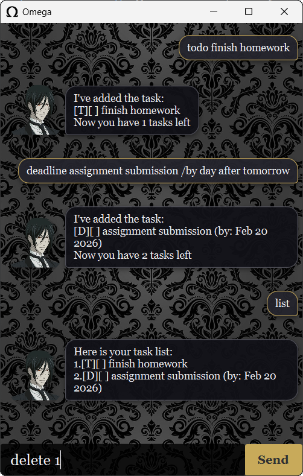

# Omega User Guide



> "I'm simply one hell of a butler." - Sebastian Michaelis

Omega is a _lightweight_ chatbot that helps you track your tasks **quickly** and **efficiently**.

## Quickstart

1. Download the latest `.jar` from the [Releases page](https://github.com/omgeta/ip/releases)
2. Place the `.jar` in a folder for your application and open a terminal
3. Run `java -jar Omega.jar`
4. Type in the commands you want to execute (refer to the featured commands below)

## Features

Note:

- Words in `<>` are parameters to be specified
- Commands with no parameters will ignore any parameters supplied (e.g. `list`)
- Commands with options, such as `/by <parameter>`, require all options to be specified (e.g.
  `deadline cook /by tomorrow` works but `deadline cook` doesn't)

### Adding todos: `todo`

Adds a todo task to the task list.

Format: `todo <description>`

Examples:

- `todo cook dinner`

Expected output:

```
I've added the task:
[T][ ] cook dinner
Now you have 1 tasks left
```

### Adding deadlines: `deadline`

Adds a deadline task to the task list.

Format: `deadline <description> /by <date>`

Examples:

- `deadline submit assignment /by 2026-10-12`
- `deadline visit friends /by tomorrow`

Expected output:

```
I've added the task:
[D][ ] submit assignment (by: Oct 12 2026)
Now you have 2 tasks left
```

### Adding events: `event`

Adds an event to the task list.

Format: `event <description> /from <date> /to <date>`

Examples:

- `event wedding reception /from 2026-10-12 /to 2026-10-14`
- `event taiwan trip /from day after tomorrow /to 1 week later`

Expected output:

```
I've added the task:
[E][ ] taiwan trip (from: Feb 20 2026 to: Feb 25 2026)
Now you have 3 tasks left
```

### Listing tasks: `list`

Displays all tasks in the task list.

Format: `list`

Expected output:

```
Here is your task list:
1.[T][ ] cook dinner
2.[D][ ] submit assignment (by: Oct 12 2026)
3.[E][ ] taiwan trip (from: Feb 20 2026 to: Feb 25 2026
```

### Finding specific tasks: `find`

Finds matching events in the task list.

Format: `find <query>`

Examples:

- `find taiwan`

Expected output:

```
Here are the matches for taiwan:
1.[E][ ] taiwan trip (from: Feb 20 2026 to: Feb 25 2026)
```

### Marking tasks as done: `mark`

Marks a task in the task list as done.

Format: `mark <number>`

Examples:

- `mark 1`

Expected output:

```
I've marked the task as done: 
[T][X] cook dinner
```

### Unmarking tasks as not done: `unmark`

Unmarks a task in the task list as not done.

Format: `unmark <number>`

Examples:

- `unmark 1`

Expected output:

```
I've unmarked the task as done: 
[T][ ] cook dinner
```

### Deleting tasks: `delete`

Deletes a task from the task list.

Format: `delete <number>`

Examples:

- `delete 1`

Expected output:

```
I've removed the task:
[T][ ] cook dinner
Now you have 2 tasks left
```

### Exiting application: `bye`

Exits the application.

Format: `bye`

Expected output:

```
Au revoir.
```


